<p align="center">
  
  
  
  
  
</p>

# ⚡ Gemini Bench

**A no-code command center for batch prompt regression testing with the Gemini API.**

Gemini Bench lets you design prompt templates with `{{variables}}`, fill a spreadsheet of test cases, execute them in rate-limited batches, and compare results side-by-side — all from a polished dark-mode UI that runs for $0 on Vercel + Supabase free tiers.

---

## Why?

Testing prompt changes against real-world inputs is tedious. You either paste into the Gemini web console one-by-one, or write throwaway Python scripts. Gemini Bench gives you a proper workflow:

1. **Write** a prompt template with `{{variable}}` placeholders
2. **Fill** a table of test inputs (paste directly from Google Sheets)
3. **Execute** a rate-limited batch against Gemini 1.5 Flash
4. **Review** results in a split-view with metrics and export

No code. No infra costs. Ship prompts with confidence.

---

## Architecture

```mermaid
graph TB
    subgraph "Frontend — Next.js App Router"
        BP["/builder<br/>Prompt Editor + Variable Table"]
        TP["/templates<br/>Starter Template Gallery"]
        DP["/dashboard<br/>Job Monitoring"]
        RP["/results/[id]<br/>Split-View Results"]
    end

    subgraph "Execution Engine — API Route"
        API["/api/batch"]
        TBR["Token Bucket<br/>Rate Limiter"]
        RET["Exponential Backoff<br/>+ Jitter Retry"]
    end

    subgraph "Data Layer"
        SB[(Supabase<br/>PostgreSQL)]
        LS["localStorage<br/>API Key + Device ID"]
    end

    TP -->|sessionStorage| BP
    BP -->|POST| API
    API --> TBR
    TBR --> RET
    RET -->|generateContent| GEM["Gemini 1.5 Flash"]
    API -->|progress updates| SB
    DP -->|poll 30s| SB
    RP -->|query| SB
    BP -->|save job| SB
    BP -->|read/write| LS
```



---

## Features

### 🔨 Batch Builder

| Feature | Description |
|---------|-------------|
| **Prompt Editor** | Write system + user prompts with `{{variable}}` syntax highlighting |
| **Variable Table** | Spreadsheet-like data input — paste tab-separated data from Google Sheets |
| **JSONL Preview** | Live-compiled output with formatted display, copy, and download |
| **Model Config** | Temperature slider and max output tokens knob |
| **Validation** | Real-time checks for empty prompts, missing variables, unfilled rows |
| **Run Dialog** | Safety mode toggle, RPM estimate, and batch execution launcher |

### 📊 Jobs Dashboard

- Auto-polling every 30 seconds with TanStack Query
- Status-aware card grid (pending → running → completed → failed)
- Animated progress bars with live request counts
- Batch savings badge showing estimated $ saved vs standard API pricing

### 🔍 Results Viewer

- **Split-view panels:** Input prompt on the left, Gemini output on the right
- **Metrics cards:** Success rate, avg latency, total tokens, batch savings
- **Result navigation:** Previous/next arrows + dropdown selector
- **Export:** CSV and JSON with full token usage and latency data

### 📚 Template Gallery

Five built-in starter templates with sample data, organized by category:

| Template | Category | Variables | Sample Rows |
|----------|----------|-----------|-------------|
| Text Summarization | NLP | `content_type`, `text` | 3 |
| Translation Quality | NLP | `target_language`, `text` | 3 |
| Sentiment Analysis | Classification | `review_type`, `review_text` | 4 |
| Code Generation | Code | `language`, `specification` | 3 |
| Q&A Extraction | RAG | `context`, `question` | 3 |

### 🛡️ Rate Limiting Engine

The execution engine implements a **token bucket algorithm** to respect Gemini free-tier limits:

| Mode | RPM | Spacing | Use Case |
|------|-----|---------|----------|
| Standard | 15 | ~4s per request | Default for most workloads |
| Safety | 10 | ~6s per request | Conservative mode for free tier |

Retries use **exponential backoff with jitter** (base 1s, max 60s, up to 4 retries). Only 429 and 5xx errors trigger retries — client errors fail immediately.

---

## Tech Stack

| Layer | Technology | Purpose |
|-------|-----------|---------|
| Framework | Next.js 16 (App Router) | SSR, API routes, file-based routing |
| Language | TypeScript 5 | Type safety across the codebase |
| UI | Shadcn/UI + Radix | 19 accessible, composable components |
| Styling | Tailwind CSS 4 | Utility-first dark-mode design |
| State | React Context + TanStack Query | API key management + data fetching with caching |
| Database | Supabase (PostgreSQL) | Job persistence, result storage, RLS |
| AI | `@google/generative-ai` | Gemini API client |
| Icons | Lucide React | Consistent iconography |

---

## Getting Started

### Prerequisites

- **Node.js** ≥ 18
- **Supabase** account (free tier) — [supabase.com](https://supabase.com)
- **Gemini API key** (free tier) — [aistudio.google.com](https://aistudio.google.com/apikey)

### 1. Clone & Install

```bash
git clone https://github.com/YOUR_USERNAME/gemini-bench.git
cd gemini-bench
npm install
```

### 2. Configure Environment

Create `.env.local` in the project root:

```env
NEXT_PUBLIC_SUPABASE_URL=https://YOUR_PROJECT.supabase.co
NEXT_PUBLIC_SUPABASE_ANON_KEY=your_anon_key_here
```

### 3. Set Up Database

Open your Supabase project's **SQL Editor** and run the contents of [`supabase/schema.sql`](supabase/schema.sql). This creates four tables:

| Table | Purpose |
|-------|---------|
| `projects` | Scope data by device ID |
| `prompt_templates` | Store prompt configurations with versioning |
| `batch_jobs` | Track batch execution state and progress |
| `batch_results` | Store individual prompt results with token usage |

### 4. Run Development Server

```bash
npm run dev
```

Open [http://localhost:3000](http://localhost:3000) (auto-redirects to `/builder`).

### 5. Connect Your API Key

Click **"Set API Key"** in the top-right header. Enter your Gemini API key — it's stored in your browser's `localStorage` (never sent to any server except Google's API).

---

## Project Structure

```
gemini-bench/
├── src/
│   ├── app/
│   │   ├── api/batch/route.ts          # Execution engine (rate limiter + retry)
│   │   ├── builder/page.tsx            # Batch builder page
│   │   ├── dashboard/page.tsx          # Jobs dashboard
│   │   ├── results/[jobId]/page.tsx    # Split-view results viewer
│   │   ├── templates/page.tsx          # Template gallery
│   │   ├── layout.tsx                  # Root layout (dark mode, sidebar)
│   │   └── page.tsx                    # Redirect → /builder
│   ├── components/
│   │   ├── api-key-dialog.tsx          # API key input + validation
│   │   ├── header.tsx                  # Sticky header bar
│   │   ├── job-card.tsx                # Job status card with progress
│   │   ├── jsonl-preview.tsx           # Compiled JSONL viewer
│   │   ├── prompt-editor.tsx           # Template editor with highlighting
│   │   ├── providers.tsx               # React Query + Context providers
│   │   ├── sidebar.tsx                 # Collapsible navigation
│   │   ├── variable-table.tsx          # Spreadsheet-like data input
│   │   └── ui/                         # 19 Shadcn/UI primitives
│   └── lib/
│       ├── api-key-context.tsx         # API key React context
│       ├── cost-calculator.ts          # Batch vs standard pricing
│       ├── export.ts                   # CSV + JSON export utilities
│       ├── gemini.ts                   # Gemini API client wrapper
│       ├── jsonl-compiler.ts           # Template → JSONL compiler
│       ├── starter-templates.ts        # 5 built-in test templates
│       ├── supabase.ts                 # Supabase client + device ID
│       └── utils.ts                    # Tailwind merge helper
├── supabase/
│   └── schema.sql                      # Full database DDL
├── .env.local                          # Environment variables (git-ignored)
└── package.json
```

---

## Data Flow

```mermaid
sequenceDiagram
    actor User
    participant Builder as /builder
    participant API as /api/batch
    participant Gemini as Gemini API
    participant DB as Supabase

    User->>Builder: Create prompt + fill variables
    User->>Builder: Click "Run Batch"
    Builder->>DB: Save template, job, result placeholders
    Builder->>API: POST /api/batch (jobId, apiKey, config)
    Builder->>User: Redirect → /dashboard

    loop For each result row
        API->>API: Acquire rate limit token
        API->>Gemini: generateContent(compiledPrompt)
        Gemini-->>API: Response (text, tokens, latency)
        API->>DB: Update result status + output
        API->>DB: Update job progress count
    end

    API->>DB: Mark job completed + savings

    User->>DB: Poll dashboard every 30s
    User->>DB: View results → /results/[jobId]
```



---

## Cost Analysis

Gemini Bench runs entirely on free tiers:

| Service | Free Tier | Gemini Bench Usage |
|---------|-----------|-------------------|
| **Vercel** | 100 GB bandwidth, serverless functions | Hosts Next.js app |
| **Supabase** | 500 MB database, 2 GB transfer | Stores jobs + results |
| **Gemini 1.5 Flash** | 15 RPM, 1M tokens/day | Prompt execution |

**Total infrastructure cost: $0/month**

The cost calculator tracks what you *would* pay at scale. Batch pricing offers a 50% discount:

| | Input (per 1M tokens) | Output (per 1M tokens) |
|---|---|---|
| Standard | $0.075 | $0.30 |
| Batch | $0.0375 | $0.15 |

---

## Security Model

| Concern | Approach |
|---------|----------|
| **API Key** | Stored in browser `localStorage` only. Never persisted to any database. Sent directly to Google's API via server-side route. |
| **Data Scoping** | Each browser gets a unique `device_id` (UUID). All queries filter by device ID. |
| **Database** | Supabase RLS is enabled on all tables. Open policies for now (no auth required). |
| **No Auth** | Intentional simplification. For production, add Supabase Auth and scope RLS policies to `auth.uid()`. |

---

## Deployment

### Prototype Deployment Checklist (Supabase)

Use this checklist if your goal is to ship fast as an MVP, not harden for production.

#### ✅ Do Now (MVP)

1. Create a Supabase project
2. Run [`supabase/schema.sql`](supabase/schema.sql) in SQL Editor
3. Set environment variables in Vercel:
    - `NEXT_PUBLIC_SUPABASE_URL`
    - `NEXT_PUBLIC_SUPABASE_ANON_KEY`
4. Deploy app and run one end-to-end smoke test:
    - Build batch in `/builder`
    - Start run
    - Confirm progress in `/dashboard`
    - Confirm outputs in `/results/[jobId]`
5. Add a basic migration file for repeatable setup (can be a direct copy of current schema)

#### ⏳ Do Later (Production Hardening)

- Supabase Auth + strict user-scoped RLS policies
- Move long-running execution to Supabase Edge Functions / background worker
- Service-role key separation (never reachable by browser)
- Staging/production DB promotion workflow with migration CI

#### ⚠️ Prototype Limitations (Intentional)

- No user accounts (data isolation is best-effort via `device_id`)
- RLS policies are open for easier local/demo setup
- Long-running batches execute through a Next.js API route and may timeout at larger scales

### Vercel (Recommended)

1. Push to GitHub
2. Import the repo in [vercel.com/new](https://vercel.com/new)
3. Set environment variables:
   - `NEXT_PUBLIC_SUPABASE_URL`
   - `NEXT_PUBLIC_SUPABASE_ANON_KEY`
4. Deploy — Vercel auto-detects Next.js

### Self-Hosted

```bash
npm run build
npm start
```

---

## Roadmap

- [ ] **Diff Visualizer** — Side-by-side output comparison between two batch runs
- [ ] **Prompt Versioning** — Track prompt changes over time with visual diff
- [ ] **Multi-Model** — Compare Gemini Flash vs Pro vs other providers
- [ ] **Supabase Auth** — User accounts with proper RLS scoping
- [ ] **Webhook Notifications** — Slack/email alerts on batch completion
- [ ] **Batch Import** — Upload CSV files directly for variable data
- [ ] **Scheduled Runs** — Cron-based regression testing

---

## Contributing

1. Fork the repo
2. Create a feature branch (`git checkout -b feat/diff-viewer`)
3. Commit changes (`git commit -m 'Add diff viewer'`)
4. Push to branch (`git push origin feat/diff-viewer`)
5. Open a Pull Request

---

## License

MIT © 2025

---

<p align="center">
  Built with ☕ and the Gemini API
</p>
