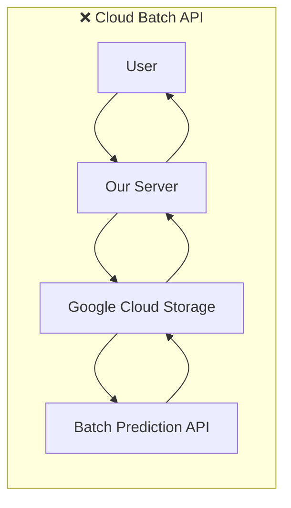
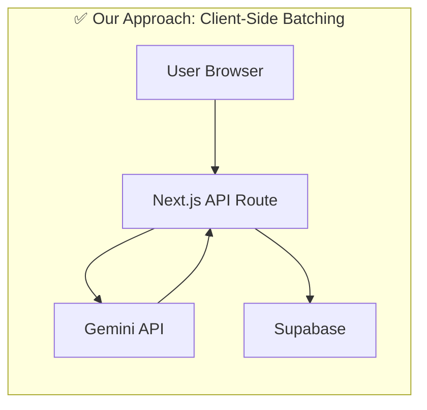
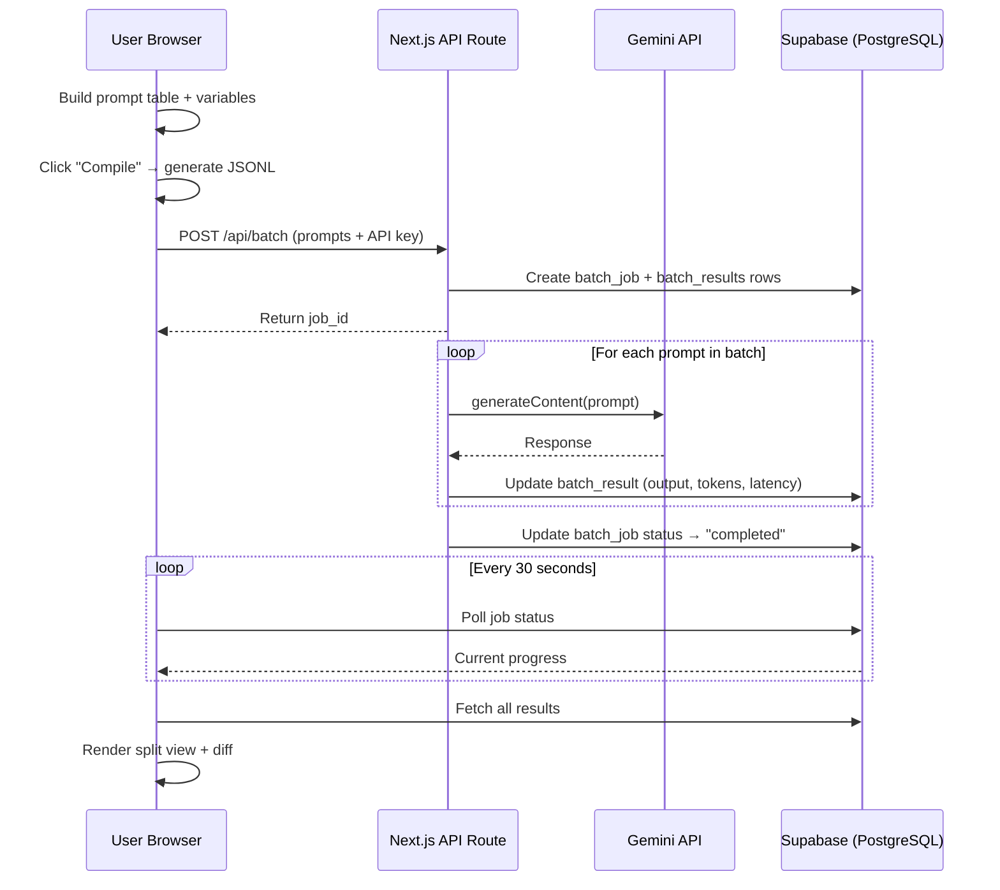

# Gemini Bench — Implementation Plan

A web-based "Command Center" for Gemini API batch prompt testing with side-by-side regression comparison. Built as a professional portfolio piece demonstrating AI product management, system design, and engineering execution.

---

## System Design Concepts

### 1. Client-Side Batching (Why Not the Cloud Batch API?)





**Trade-off analysis:**

| Factor | Cloud Batch API | Client-Side Batching |
|--------|----------------|---------------------|
| Cost | Requires GCS + billing project | **$0 — API key only** |
| Auth complexity | Service account + IAM | **Just an API key** |
| 50% batch discount | Yes | No (but free tier = $0 anyway) |
| Infra skills shown | GCS wiring | **Queue design, rate limiting, retry logic** |
| User friction | Must configure GCP project | **Paste API key, start testing** |

**Decision:** Client-side batching. The queue/throttler we build is *more* technically impressive and demonstrates system design thinking. The Cloud Batch API is just configuration — our approach is engineering.

### 2. Rate Limiting Strategy

Gemini 1.5 Flash free tier limits:
- **15 RPM** (requests per minute)
- **1,500 RPD** (requests per day)
- **1M TPM** (tokens per minute)

We implement a **Token Bucket** algorithm:
- Bucket capacity = 15 tokens (1 per request)
- Refill rate = 1 token every 4 seconds
- On 429 response → **exponential backoff** (1s → 2s → 4s → 8s, max 60s)
- "Safety Mode" toggle cuts rate to 10 RPM with wider spacing

### 3. Polling vs. WebSockets

**We use polling (30s interval via TanStack Query).**

| Factor | Polling | WebSockets |
|--------|---------|------------|
| Complexity | Low — HTTP GET | High — connection management |
| Cost on Vercel | Free (serverless) | **$$$ — requires persistent server** |
| Reliability | Very high | Reconnection logic needed |
| Latency | 0–30s delay | Real-time |

Since batch jobs take minutes to hours, 30-second polling is perfectly adequate. WebSockets would add complexity for zero user-perceptible benefit.

### 4. Data Flow Architecture



---

## Database Schema (Supabase)

```sql
-- Projects group related prompt tests
CREATE TABLE projects (
  id UUID PRIMARY KEY DEFAULT gen_random_uuid(),
  device_id TEXT NOT NULL,
  name TEXT NOT NULL,
  description TEXT DEFAULT '',
  created_at TIMESTAMPTZ DEFAULT NOW(),
  updated_at TIMESTAMPTZ DEFAULT NOW()
);

-- Prompt templates with versioning
CREATE TABLE prompt_templates (
  id UUID PRIMARY KEY DEFAULT gen_random_uuid(),
  project_id UUID REFERENCES projects(id) ON DELETE CASCADE,
  name TEXT NOT NULL,
  system_prompt TEXT DEFAULT '',
  user_prompt_template TEXT NOT NULL,  -- "Summarize this: {{text}}"
  model TEXT DEFAULT 'gemini-1.5-flash',
  generation_config JSONB DEFAULT '{"temperature": 0.7, "maxOutputTokens": 1024}',
  version INT DEFAULT 1,
  parent_version_id UUID REFERENCES prompt_templates(id),
  created_at TIMESTAMPTZ DEFAULT NOW()
);

-- Batch jobs track execution state
CREATE TABLE batch_jobs (
  id UUID PRIMARY KEY DEFAULT gen_random_uuid(),
  project_id UUID REFERENCES projects(id) ON DELETE CASCADE,
  template_id UUID REFERENCES prompt_templates(id),
  name TEXT NOT NULL,
  status TEXT DEFAULT 'pending'
    CHECK (status IN ('pending','running','completed','failed','cancelled')),
  total_requests INT DEFAULT 0,
  completed_requests INT DEFAULT 0,
  failed_requests INT DEFAULT 0,
  model TEXT DEFAULT 'gemini-1.5-flash',
  generation_config JSONB DEFAULT '{}',
  safety_mode BOOLEAN DEFAULT false,
  estimated_savings_usd NUMERIC(10,6) DEFAULT 0,
  started_at TIMESTAMPTZ,
  completed_at TIMESTAMPTZ,
  created_at TIMESTAMPTZ DEFAULT NOW()
);

-- Individual results within a batch
CREATE TABLE batch_results (
  id UUID PRIMARY KEY DEFAULT gen_random_uuid(),
  job_id UUID REFERENCES batch_jobs(id) ON DELETE CASCADE,
  row_index INT NOT NULL,
  input_variables JSONB NOT NULL,
  compiled_prompt TEXT NOT NULL,
  output TEXT,
  token_usage JSONB DEFAULT '{}',
  latency_ms INT,
  status TEXT DEFAULT 'pending'
    CHECK (status IN ('pending','running','completed','failed')),
  error TEXT,
  created_at TIMESTAMPTZ DEFAULT NOW()
);

CREATE INDEX idx_batch_results_job ON batch_results(job_id);
CREATE INDEX idx_batch_jobs_project ON batch_jobs(project_id);
CREATE INDEX idx_prompt_templates_project ON prompt_templates(project_id);
```

**`device_id` pattern:** Since we skip auth, each browser generates a UUID on first visit (stored in localStorage). All queries are scoped by `device_id`. RLS policies enforce this at the database level.

---

## Build Progress

### Phase 1: Foundation ✅
- Next.js project setup (App Router, TypeScript, Tailwind)
- Shadcn/UI initialization (19 components)
- Supabase schema + client
- API key management (context + dialog)
- Root layout, sidebar, header

### Phase 2: Batch Builder ✅
- JSONL compiler (variable extraction, compilation, validation)
- Prompt Editor (syntax highlighting, model config)
- Variable Table (inline editing, paste support)
- JSONL Preview (formatted view, copy, download)
- Full Builder page with tabs, validation, run dialog

### Phase 3: Execution Engine ✅
- Batch API route with token bucket rate limiter
- Exponential backoff with jitter for retries
- Per-result Supabase progress tracking
- Cost savings calculator

### Phase 4: Jobs Dashboard ✅
- Job card component (status colors, progress bar, savings)
- Dashboard page with 30s auto-polling
- Empty state + loading skeletons

### Phase 5: Results Viewer ✅
- Split-view results page (input/output panels)
- Metrics cards (success rate, latency, tokens, savings)
- Result navigation (prev/next/dropdown)
- CSV + JSON export

### Phase 6: Templates ✅
- 5 starter templates (Summarization, Translation, Sentiment, Code Gen, Q&A)
- Template gallery with category grouping
- Session-based template loading into builder

### Phase 7: Build Verification ✅
- `npm run build` — zero errors
- Visual testing of Builder, Templates, Dashboard pages

---

## Remaining Work
- [ ] Run Supabase schema migration
- [ ] End-to-end test with real Gemini API key

---

## Project File Structure

```
src/
├── app/
│   ├── api/batch/route.ts       # Batch execution API (rate limiter, retries)
│   ├── builder/page.tsx         # Prompt builder with variable table
│   ├── dashboard/page.tsx       # Job monitoring with auto-polling
│   ├── results/[jobId]/page.tsx # Split-view results viewer
│   ├── templates/page.tsx       # Starter template gallery
│   ├── layout.tsx               # Root layout (sidebar + header)
│   ├── page.tsx                 # Redirects to /builder
│   └── globals.css
├── components/
│   ├── api-key-dialog.tsx       # API key input/validation modal
│   ├── header.tsx               # Top bar with API key status
│   ├── job-card.tsx             # Dashboard job card
│   ├── jsonl-preview.tsx        # Compiled JSONL preview
│   ├── prompt-editor.tsx        # Template editor with highlighting
│   ├── providers.tsx            # React Query + API Key context
│   ├── sidebar.tsx              # Navigation sidebar
│   ├── variable-table.tsx       # Spreadsheet-like variable grid
│   └── ui/                     # 19 Shadcn/UI components
├── lib/
│   ├── api-key-context.tsx      # API key React context
│   ├── cost-calculator.ts       # Batch pricing calculator
│   ├── export.ts                # CSV/JSON export utilities
│   ├── gemini.ts                # Gemini API client wrapper
│   ├── jsonl-compiler.ts        # Variable extraction + JSONL compilation
│   ├── starter-templates.ts     # 5 built-in prompt templates
│   ├── supabase.ts              # Supabase client + device ID
│   └── utils.ts                 # cn() utility
└── supabase/
    └── schema.sql               # PostgreSQL schema (4 tables)
```

## Tech Stack
- **Framework:** Next.js 16 (App Router) with TypeScript
- **Styling:** Tailwind CSS 4 + Shadcn/UI
- **Database:** Supabase (PostgreSQL)
- **AI:** Google Gemini 1.5 Flash via `@google/generative-ai`
- **State:** TanStack React Query (polling) + React Context (API key)
- **Font:** Inter (Google Fonts)

## Key Design Decisions
1. **Client-side batching** over Cloud Batch API — $0 cost, more impressive engineering
2. **Token bucket rate limiter** — respects 15 RPM free tier limits
3. **Polling over WebSockets** — simpler, free on Vercel, adequate for batch job monitoring
4. **Device ID auth** — no user accounts needed, localStorage-based UUID scoping
5. **API key stored client-side only** — BYOK pattern, never persisted server-side
6. **Turbopack disabled** — switched to webpack due to Turbopack panic bug in Next.js 16
