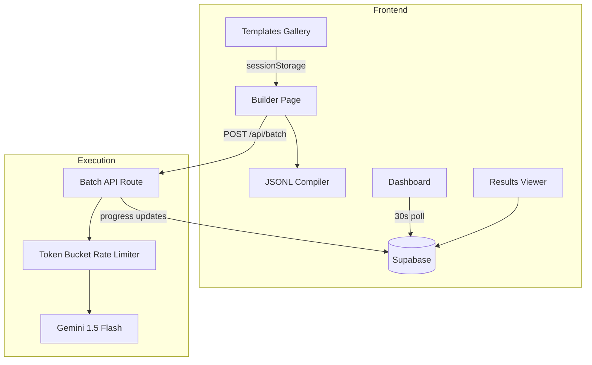

# Gemini Bench — Build Walkthrough

## What Was Built

A complete batch prompt testing command center for the Gemini API, built as a portfolio-grade Next.js application.

### Architecture



### Pages Implemented

| Page | Route | Key Features |
|------|-------|-------------|
| Builder | `/builder` | Prompt editor with variable syntax highlighting, spreadsheet-like variable table, JSONL preview with copy/download, run dialog with safety mode |
| Dashboard | `/dashboard` | Auto-polling job cards with progress bars, status-aware color coding, savings badges |
| Results | `/results/[jobId]` | Split-view input/output panels, metrics cards (success rate, latency, tokens, savings), CSV/JSON export |
| Templates | `/templates` | 5 starter templates across 4 categories, one-click loading into builder |

### Core Engine

- **Rate Limiter:** Token bucket algorithm (15 RPM standard, 10 RPM safety mode)
- **Retry Logic:** Exponential backoff with jitter (max 4 retries, only on 429/5xx)
- **Cost Calculator:** Compares standard vs batch pricing, tracks savings per job

## Verification

### Build
`npm run build` completed with **zero errors** — all routes compiled and registered.

### Visual Testing

````carousel

<!-- slide -->

````

### Remaining Steps
1. Run Supabase schema migration (`supabase/schema.sql`)
2. Add comprehensive README with Mermaid architecture diagram
3. End-to-end test with real Gemini API key
